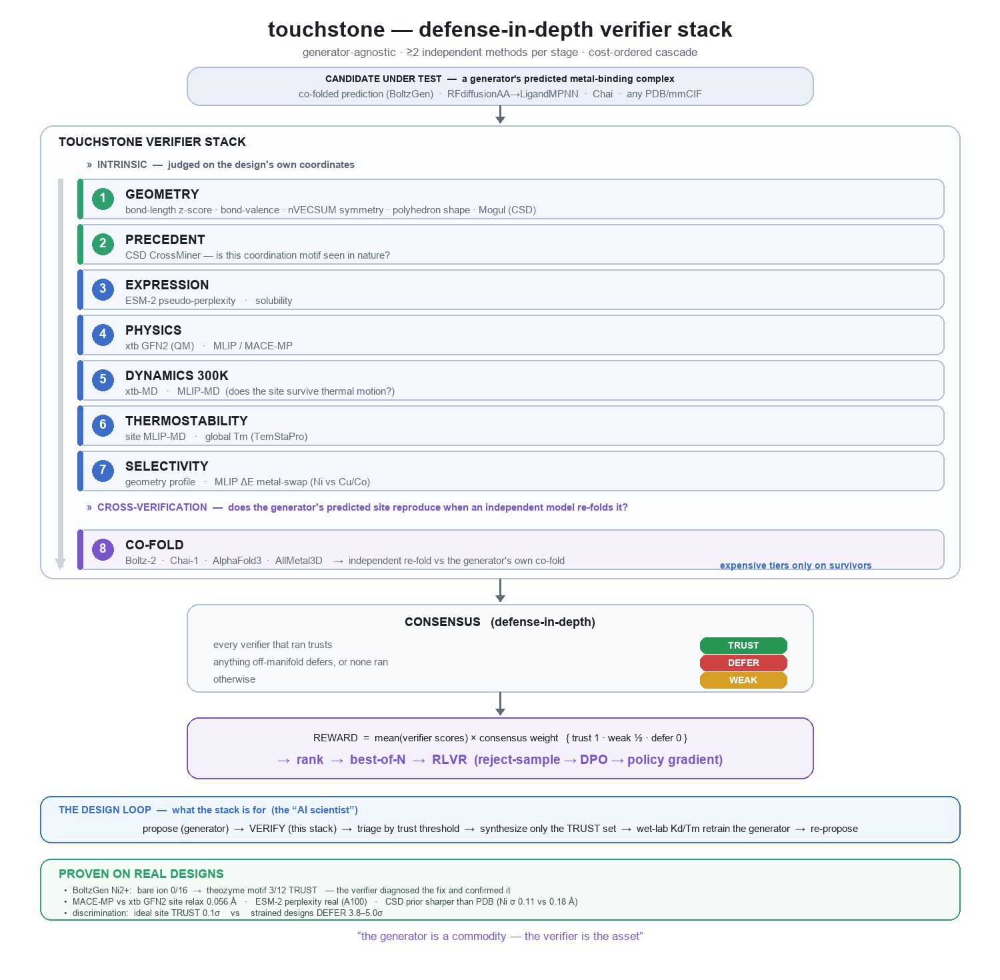

# Verifying designs with touchstone

`touchstone` is a generator-agnostic verifier for designed metal-binding proteins. After
BoltzGen (or any generator) proposes a metal binder, touchstone judges whether the
*predicted* coordination site is real enough to take to wet-lab — a trust/weak/defer
consensus across independent methods (geometry + bond-valence + CSD, plus MLIP physics
and co-fold cross-checks when available).

It is wired in as an MCP server (`.mcp.json`), so any agent in this repo can call it; `uvx`
pulls it from the public [`charleneleong-ai/ai4science`](https://github.com/charleneleong-ai/ai4science)
repo on first use (requires `uv` on PATH). No install or vendoring.

## Verifier stack



*Candidate → intrinsic checks (geometry: z-score · bond-valence · nVECSUM · polyhedron shape · Mogul; + precedent / expression / physics / dynamics / thermostability / selectivity) → cross-verification (independent co-fold) → consensus → reward / design loop.*

Defense-in-depth — independent methods across complementary axes; each design gets a
trust/weak/defer per tier, rolled into one `consensus` (a single `defer` collapses it):

- **Geometry — always on, CPU:** bond lengths vs reference (z-score) · bond-valence sum ·
  nVECSUM symmetry (is the metal enclosed?) · polyhedron shape vs ideal — [CheckMyMetal](https://journals.iucr.org/m/issues/2024/05/00/be5298/)
  parity on the static site.
- **Physics — `deep=True`, GPU:** MLIP (MACE) relaxation · 300 K MLIP-MD — does the site
  hold and survive thermal motion?
- **Precedent / protein / cross-checks — need an input:** CSD Mogul (licence) · co-fold
  re-prediction · ESM expression · Tm thermostability · TRS topology-reorganization (apo).

The cheap CPU tiers run anywhere; the rest light up when a GPU / licence / scorer / apo
structure is present, otherwise they report `needs_input` rather than guessing.

## When to use it
- After generating a metal-binder structure (`.pdb` / `.cif`) → verify **before** wet-lab.
- Choosing which of several candidates to synthesize → keep only the `trust` set.
- Scoring designs as a reward signal for iteration.

## How to call it
MCP tool (preferred — available to the agent automatically):

> `verify_metal_binder(structure_path="design.cif", metal="Ni2+", deep=False, stress=False)`

### Parameters
| param | type | default | meaning |
| --- | --- | --- | --- |
| `structure_path` | str | — (required) | path to the design (`.pdb` / `.cif`) containing the metal + protein |
| `metal` | str | `"Ni2+"` | target metal label. Empirical reference priors exist for `Ni2+`, `Cu2+`, `Co2+`; other metals run the angle/symmetry tiers but defer where a prior is missing |
| `deep` | bool | `False` | also run MLIP (MACE) relaxation + 300 K MD — **needs a GPU**. Default is the instant CPU tiers, which run anywhere |
| `stress` | bool | `False` | also return a robustness map (`neutral` / `leachate` bond-stretch / `low_pH` donor-protonation) — does the site hold up under recovery-process conditions? |

## Reading the result
A JSON dict with per-tier verdicts (each `label` / `score` / `reason` + a `metrics` block of
raw numbers), a `stack` listing every tier with its `status` (`ran` / `skipped` /
`needs_input`), and a top-level `consensus`:

- **trust** — every verifier that ran agrees the site is on-manifold → clears the wet-lab bar.
- **weak** — judgeable but not confidently sound → iterate, don't synthesize yet.
- **defer** — off-manifold, or a verifier couldn't run → reject / needs a different check.

Consensus is defense-in-depth: a single `defer` collapses it. **Only `trust` is worth wet-lab.**

## The stack — what runs, and the numbers each tier reports
Returned under `stack` (cost order), each tier `ran` / `skipped` / `needs_input`:

| tier | runs | checks | key `metrics` |
| --- | --- | --- | --- |
| `geometry` | always (CPU) | M–donor bond lengths vs reference (z-score) + CN | `strain_sigma`, `cn`, `cn_modal` |
| `bond_valence` | always (CPU) | bond-valence sum vs formal charge | `bvs`, `formal_valence`, `delta` |
| `coord_symmetry` | always (CPU) | nVECSUM — is the metal enclosed, or one-sided? | `nvecsum` (0 = enclosed, →1 = lopsided) |
| `coord_geometry` | always (CPU) | polyhedron shape vs ideal (tet/sq-planar/oct/…) | `angle_rmsd_deg` |
| `mlip` | `deep=True` (GPU) | MACE relaxation — does the site hold? | `drift_angstrom`, `cn_before/after`, `interaction_energy_ev` |
| `mlip_md` | `deep=True` (GPU) | 300 K MD — does the shell survive? | `retention`, `cn_initial` |
| `mogul` | needs CSD licence | per-bond CSD geometry (Mogul) | — |
| `trs` | needs apo structure | topology reorganization on binding | — |
| `cofold` / `expression` / `thermostability` | needs a scorer | independent re-fold / ESM expression / Tm | — |

The four CPU tiers cover the static metal site to [CheckMyMetal](https://journals.iucr.org/m/issues/2024/05/00/be5298/) parity (lengths · valence · nVECSUM · geometry); the rest add physics, precedent, and protein-level checks when their inputs are available.

## Sample output (rendered)
The MCP tool returns a JSON dict; the CLI / agent renders it like this. Real runs.

**Default — CPU, runs anywhere** (a clean ideal Ni site → every tier passes → `TRUST`):
```
┏━━━━━━━━━━━━━━━━┳━━━━━━━━━┳━━━━━━━┳━━━━━━━━━━━━━━━━━━━━━━━━━━━━━━━━━━━━━━━━━━━┓
┃ verifier       ┃ verdict ┃ score ┃ reason                                    ┃
┡━━━━━━━━━━━━━━━━╇━━━━━━━━━╇━━━━━━━╇━━━━━━━━━━━━━━━━━━━━━━━━━━━━━━━━━━━━━━━━━━━┩
│ geometry       │ trust   │ 0.127 │ plausible (0.3σ, coordination in range)   │
│ bond_valence   │ trust   │ 0.913 │ BVS 1.83 vs formal 2 (Δ0.17)              │
│ coord_symmetry │ trust   │ 1.000 │ vector-sum 0.00 (metal enclosed)          │
│ coord_geometry │ trust   │ 1.000 │ polyhedron fit 0.0° RMS vs ideal CN6      │
└────────────────┴─────────┴───────┴───────────────────────────────────────────┘
consensus: TRUST  (CN 6, donors ['N','N','O','O','N','O'])
robustness: neutral trust, leachate weak, low_pH trust          ← stress=True
not run (needs input): mogul, trs, cofold, expression, thermostability
```

**`deep=True` (GPU) + `stress=True`** — `mlip` / `mlip_md` now run (MACE relax + 300 K MD on the A100); a real LigandMPNN CN5 pack → `DEFER`:
```
┏━━━━━━━━━━━━━━━━┳━━━━━━━━━┳━━━━━━━┳━━━━━━━━━━━━━━━━━━━━━━━━━━━━━━━━━━━━━━━━━━━━━━━━━━━┓
┃ verifier       ┃ verdict ┃ score ┃ reason                                            ┃
┡━━━━━━━━━━━━━━━━╇━━━━━━━━━╇━━━━━━━╇━━━━━━━━━━━━━━━━━━━━━━━━━━━━━━━━━━━━━━━━━━━━━━━━━━━┩
│ geometry       │ weak    │ 0.025 │ strained geometry (2.3σ)                          │
│ bond_valence   │ defer   │ 0.023 │ BVS 0.90 vs formal 2 (Δ1.10) — defer              │
│ coord_symmetry │ trust   │ 0.700 │ vector-sum 0.25 (enclosed)                        │
│ coord_geometry │ weak    │ 0.497 │ polyhedron fit 23.6° RMS vs ideal CN5             │
│ mlip           │ defer   │ 0.088 │ site lost 2 donor(s), drift 1.92 Å, ΔE_bind -3.33 │
│                │         │       │ eV — defer                                        │
│ mlip_md        │ defer   │ 0.059 │ shell survived 6% of 300 K MD — defer             │
└────────────────┴─────────┴───────┴───────────────────────────────────────────────────┘
consensus: DEFER  (CN 5, donors ['O','O','N','O','N'])
robustness: neutral weak, leachate defer, low_pH trust          ← stress=True
not run (needs input): mogul, trs, cofold, expression, thermostability
```
Without a GPU the `mlip` / `mlip_md` rows read `skipped: no MLIP backend` instead — the
consensus is still decided by whatever ran. `robustness:` is the `stress` map; `not run`
lists the tiers awaiting a licence (CSD/Mogul), an apo structure (TRS), or a scorer.

## Scope
The trust threshold is grounded in CSD geometry + physics, **not yet calibrated to wet-lab
outcomes** — read `trust` as "physically / precedent-plausible," not a calibrated binding
probability. Tiers needing a GPU (MLIP) or a licence (CSD/Mogul) report as `needs_input`
rather than guessing.
